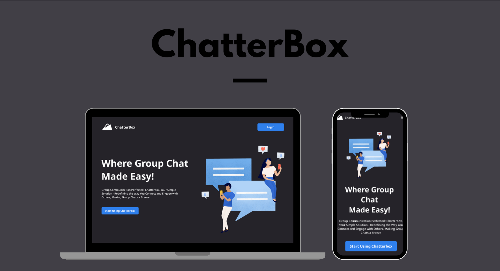

# ChatterBox

Where Group Chat Made Easy!

ChatterBox is a cutting-edge group chat app designed to revolutionize your communication experience. Whether it's connecting with friends, family, or colleagues, ChatterBox offers a seamless and intuitive platform for all your group messaging needs. With its cross-platform capabilities and customizable profiles, ChatterBox brings a new level of convenience and personalization to your conversations.

## Concept

## Links

- Figma : https://www.figma.com/file/Un6O27HvtnsthkJW1bkAqV/ChatterBox?type=design&node-id=0-1&mode=design&t=79Zd6xBTlITprgfl-0

-

## Features

### Main Features

- Enter welcome page by default
- Register and Login
- Send messages
- See others messages
- Create new channel with name and description
- See and update my account detail
- See others account detail
- Enter channel of my choice
- Search channel
- See member of channel

### Future Improvements

- Search message
- See others typing status
- Send image to others

## Contributors

| Name            |               Role               |
| --------------- | :------------------------------: |
| Niko Setiawan P | Team Lead and Front-End Engineer |
| Immanuel Arya   |        Front-End Engineer        |
| Nurdin Beta     |        Front-End Engineer        |
| Yanky Hermawan  |        Back-End Engineer         |
| Gary Cruise     |        Back-End Engineer         |

## Tech Stack

